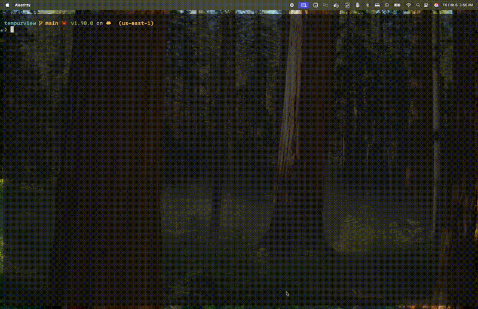

<p align="center">
  
</p>

<h1 align="center">TemPurview</h1>

<p align="center">
  Your purview into what your Temporal workflows are doing.
</p>

<p align="center">
  <a href="https://crates.io/crates/tempurview"></a>
  <a href="https://github.com/Tatch-AI/tempurview/actions/workflows/ci.yml"></a>
  <a href="https://github.com/Tatch-AI/tempurview/blob/main/proto/temporal-api/LICENSE"></a>
  <a href="https://tatch-ai.github.io/tempurview/"></a>
</p>

---

<p align="center">
  
</p>

<!-- TODO: Add CLI demo GIF (insight scan, workflow list, jq piping) -->

## Why TemPurview?

Temporal's web UI shows you individual workflows. TemPurview gives you **fleet-level visibility** -- scan hundreds of workflows for retry storms, failure hotspots, and stuck executions in seconds. Everything is keyboard-driven, pipe-friendly, and designed to slot into the same terminal where you already live.

## Feature Highlights

| | Feature | Description |
|---|---|---|
| **Fleet Insights** | 11 finding algorithms | Detect retry storms, failure hotspots, stuck workflows, queue latency, long-running activities, child workflow issues, and more |
| **CLI Pipelines** | JSON-as-API | Output auto-detects TTY vs pipe; compose with `jq`, shell scripts, and AI agents |
| **TUI Navigation** | 9 views, keyboard-driven | Status filters, date ranges, column toggles, sort modes, full-text search |
| **Web UI** | `tpv serve` | Browser-based dashboard backed by the same gRPC client |

## Install

```bash
cargo install tempurview
```

The binary is available as both `tempurview` and `tpv`.

## Quick Start

### Connect to Temporal Cloud

```bash
export TEMPORAL_ADDRESS="your-namespace.tmprl.cloud:7233"
export TEMPORAL_NAMESPACE="your-namespace"
export TEMPORAL_API_KEY="your-api-key"

# Launch the interactive TUI
tpv

# Or use CLI mode
tpv workflow list
tpv workflow get <workflow-id>
tpv insight scan --since 24h
```

### Try it without a connection

```bash
tpv --mock
```

### Use a config file

Create `~/.tempurview/config.toml`:

```toml
[insights]
allowlist = ["PaymentWorkflow", "OrderProcessing"]
```

## Command Showcase

CLI output is **table** in a terminal, **JSON** when piped. Force a format with `--output json` or `--output table`.

```bash
# Find your noisiest failing workflow types
tpv workflow list --status failed -o json \
  | jq '.[] | .workflow_type' | sort | uniq -c | sort -rn

# Surface critical findings from the last 2 hours
tpv insight scan --since 2h -o json \
  | jq '.findings[] | select(.severity == "critical")'

# Quick count of running workflows
tpv workflow count --status running

# View activities for a specific execution
tpv activity list <workflow-id>

# Test your connection
tpv test-connection
```

## Shell Completions

```bash
# Bash
tpv completions bash > ~/.local/share/bash-completion/completions/tpv

# Zsh
tpv completions zsh > ~/.zfunc/_tpv

# Fish
tpv completions fish > ~/.config/fish/completions/tpv.fish
```

## Configuration

Configuration is resolved in priority order: **CLI flags > environment variables > config file > defaults**.

| Variable | Default | Description |
|---|---|---|
| `TEMPORAL_ADDRESS` | `localhost:7233` | Temporal server address |
| `TEMPORAL_NAMESPACE` | `default` | Temporal namespace |
| `TEMPORAL_API_KEY` | -- | API key for Temporal Cloud |
| `TEMPORAL_TUI_REFRESH_INTERVAL` | `30` | Auto-refresh interval in seconds |
| `TEMPORAL_TUI_DEFAULT_LIMIT` | `50` | Max workflows to fetch per page |
| `TEMPORAL_TUI_TICK_RATE` | `250` | TUI tick rate in milliseconds |

All of the above can also be set via CLI flags (`--address`, `--namespace`, `--limit`). Run `tpv config show` to see the resolved configuration.

<details>
<summary><strong>TUI Keybindings</strong></summary>

### Navigation

| Key | Action | Context |
|---|---|---|
| `j` / `k` | Move down / up | All list views |
| `g` / `G` | Go to top / bottom | All views |
| `Ctrl+D` / `Ctrl+U` | Half-page down / up | All views |
| `PgUp` / `PgDn` | Page up / down | All views |
| `Enter` | Select / view details | List views |
| `Esc` | Go back | All views |

### Filtering

| Key | Action | Context |
|---|---|---|
| `/` | Open filter/search input | WorkflowList, TypeList, detail views |
| `1`-`7` | Filter by status (Running, Completed, Failed, Canceled, Terminated, TimedOut, ContinuedAsNew) | WorkflowList |
| `0` | Clear all filters | WorkflowList |
| `]` / `[` | Next / previous status filter | WorkflowList |
| `d` | Enter date range mode | WorkflowList, TypeList |
| `n` / `N` | Next / previous search match | Detail views |

### Date Range (after pressing `d`)

| Key | Action |
|---|---|
| `1`-`6` | Preset: 1h / 6h / 24h / 3d / 7d / 30d |
| `0` | Clear date range |
| `c` | Custom input (e.g. `2h`, `3d`, `1w`) |

### Views

| Key | Action | Context |
|---|---|---|
| `T` | Workflow Types view | WorkflowList |
| `I` | Health Insights scan | WorkflowList |
| `a` | Activities | WorkflowDetail |
| `l` | Event log | WorkflowDetail |
| `s` | Enter sort mode | WorkflowList, TypeList |

### Column Visibility

| Key | Action |
|---|---|
| `F1` | Toggle Status column |
| `F2` | Toggle Type column |
| `F3` | Toggle Workflow ID column |
| `F4` | Toggle Started column |

### Actions

| Key | Action | Context |
|---|---|---|
| `r` | Refresh data / re-scan | All views |
| `x` | Copy workflow URL | WorkflowDetail |
| `gx` | Open workflow in browser | WorkflowDetail |
| `c` | Cancel workflow | WorkflowDetail |
| `t` | Terminate workflow | WorkflowDetail |
| `?` | Toggle help overlay | All views |
| `q` | Quit (press twice) | Global |

### Insight Detail

| Key | Action |
|---|---|
| `n` / `p` | Next / previous affected entity |
| `Enter` | Drill into workflow detail |

</details>

## Architecture

TemPurview follows **The Elm Architecture** (TEA): every keypress produces an `Action`, the `update` function returns `Effect`s, and side effects run asynchronously through a CLI worker. The same gRPC client powers the TUI, CLI, and web server.

See the [design docs](design-docs/) for slide decks on philosophy, architecture, and CLI design.

## Contributing

```bash
git clone https://github.com/Tatch-AI/tempurview.git
cd tempurview

# Enable git hooks (auto-rebuilds binary on commit)
git config core.hooksPath hooks

# Build (compiles proto files via build.rs)
cargo build

# Run tests
cargo test

# Run with mock data
cargo run -- --mock

# Run a specific CLI command
cargo run -- workflow list --mock
```

## Documentation

- [mdBook docs](https://tatch-ai.github.io/tempurview/) -- configuration, CLI reference, TUI guide
- [Design docs](design-docs/) -- Marp slide decks on philosophy, architecture, and CLI design

## Built With

| Crate | Role |
|---|---|
| [tokio](https://tokio.rs) | Async runtime |
| [ratatui](https://ratatui.rs) | Terminal UI framework |
| [tonic](https://github.com/hyperium/tonic) | gRPC client |
| [axum](https://github.com/tokio-rs/axum) | Web server |
| [clap](https://docs.rs/clap) | CLI argument parsing |
| [comfy-table](https://github.com/nukesor/comfy-table) | Table output formatting |
| [serde](https://serde.rs) | Serialization |

## License

MIT
